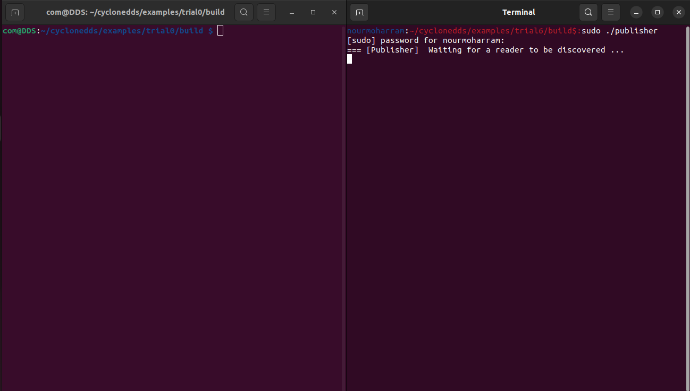
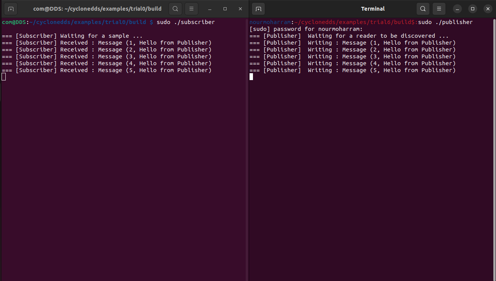

# CycloneDDS-x86-RPi-Communication

This repository contains a project demonstrating communication between two nodes using CycloneDDS. The project establishes reliable data exchange between an x86 host machine and a Raspberry Pi. The x86 machine acts as a publisher, while the Raspberry Pi acts as a subscriber. This setup is ideal for learning and implementing distributed systems using CycloneDDS.

## Installation Guide

Follow these steps to install CycloneDDS on your machines:

1. Install necessary packages:
    ```sh
    sudo apt-get install git cmake gcc
    ```

2. Clone the CycloneDDS repository:
    ```sh
    git clone https://github.com/eclipse-cyclonedds/cyclonedds.git
    cd cyclonedds
    ```

3. Build and install CycloneDDS:
    ```sh
    mkdir build
    cd build
    cmake -DCMAKE_INSTALL_PREFIX=<install-location> -DBUILD_EXAMPLES=ON ..
    cmake --build . --parallel
    cmake --build . --target install
    ```

Replace `<install-location>` with your desired installation directory.

## TopicDiscovery.idl File

The `TopicDiscovery.idl` file defines the data structure used for communication between the publisher and subscriber:

```idl
module TopicDiscovery {
    struct Data {
         long messageID;
         string message;
    };
};
```

### Publisher Discovery Explanation

In the publisher code, the following sections handle the discovery of a subscriber:

1. **Setting the Status Mask**:

   ```c
   rc = dds_set_status_mask(writer, DDS_PUBLICATION_MATCHED_STATUS);
   if (rc != DDS_RETCODE_OK)
       DDS_FATAL("dds_set_status_mask: %s\n", dds_strretcode(-rc));
   ```

   This code sets the status mask to detect when a matching subscriber is found.

2. **Waiting for a Subscriber**:

   ```c
   while (!(status & DDS_PUBLICATION_MATCHED_STATUS))
   {
       rc = dds_get_status_changes(writer, &status);
       if (rc != DDS_RETCODE_OK)
           DDS_FATAL("dds_get_status_changes: %s\n", dds_strretcode(-rc));
   
       dds_sleepfor(DDS_MSECS(20));
   }
   ```

   This loop continuously checks for a matching subscriber and pauses the publisher until one is discovered.

### Subscriber Discovery of Topic

The `subscriber.c` program is designed to discover and subscribe to the `TopicDiscovery_Data` topic using CycloneDDS. Here’s how it accomplishes topic discovery:

1. **Creating Participant and Topic:**

   ```c
   participant = dds_create_participant (DDS_DOMAIN_DEFAULT, NULL, NULL);
   if (participant < 0)
       DDS_FATAL("dds_create_participant: %s\n", dds_strretcode(-participant));
   
   topic = dds_create_topic (
       participant, &TopicDiscovery_Data_desc, "TopicDiscovery_Data", NULL, NULL);
   if (topic < 0)
       DDS_FATAL("dds_create_topic: %s\n", dds_strretcode(-topic));
   ```

   - **Participant Creation:** Initializes the DDS participant on the default domain.
   - **Topic Creation:** Defines the topic `TopicDiscovery_Data` using the `TopicDiscovery` module structure described in `TopicDiscovery.idl`.

2. **Creating a Reliable Reader:**

   ```c
   qos = dds_create_qos ();
   dds_qset_reliability (qos, DDS_RELIABILITY_RELIABLE, DDS_SECS (10));
   reader = dds_create_reader (participant, topic, qos, NULL);
   if (reader < 0)
       DDS_FATAL("dds_create_reader: %s\n", dds_strretcode(-reader));
   dds_delete_qos(qos);
   ```

   - **QoS Setup:** Configures Quality of Service (QoS) parameters to ensure reliable message delivery within 10 seconds.
   - **Reader Creation:** Creates a reliable reader associated with the participant and topic, ready to receive data.

3. **Waiting for Data:**

   ```c
   while (1)
   {
       /* Poll for data */
       dds_sleepfor (DDS_MSECS (20));
   }
   ```

   - **Polling Loop:** Continuously polls for incoming data. When a valid sample is received, it processes and prints the message content.


### Building CycloneDDS Project and Demonstrating Communication

Follow these steps to build the CycloneDDS project:

1. **Create Build Directory:**

   ```bash
   mkdir build
   cd build
   ```

2. **Configure with CMake:**

   ```bash
   cmake -DCMAKE_PREFIX_PATH=/path/to/cyclonedds_install_dir ..
   ```

   - Replace `/path/to/cyclonedds_install_dir` with the actual installation path of CycloneDDS on your x86 machine.

3. **Build the Project:**

   ```bash
   cmake --build .
   ```

#### Running Publisher and Subscriber

1. **Run Publisher on x86 Machine:**

   - Ensure the CycloneDDS publisher executable is built and accessible in your `build` directory.

   - Open a terminal on your x86 machine.

   - Navigate to the `build` directory.

   - Execute the publisher program:

     ```bash
     ./publisher
     ```

   - The publisher will start sending data.

2. **Run Subscriber on Raspberry Pi:**

   - Ensure the CycloneDDS subscriber executable is built and accessible in your Raspberry Pi.

   - Open a terminal on your Raspberry Pi.

   - Navigate to the directory where the subscriber executable is located.

   - Execute the subscriber program:

     ```bash
     ./subscriber
     ```

   - The subscriber will start listening for and receiving data published by the x86 machine.



